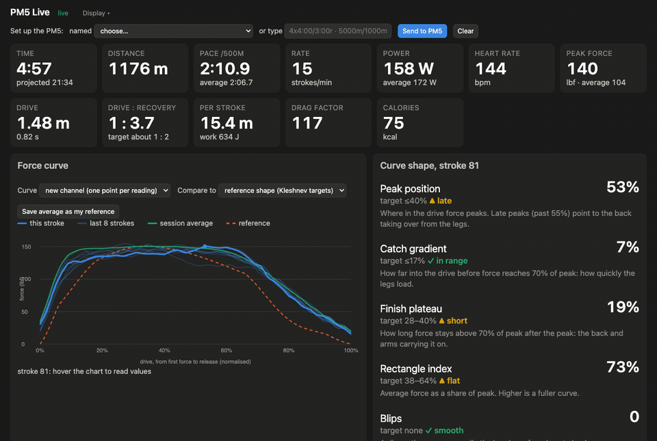

# pm5-force-logger

**Use it now, nothing to install: [jonstraveladventures.github.io/pm5-force-logger](https://jonstraveladventures.github.io/pm5-force-logger/)** in Chrome or Edge. Wake the PM5, press Connect, row.

Record every stroke from a Concept2 PM5 over Bluetooth, including its force curve, and watch the data live in your browser.

The Concept2 Logbook keeps the time, distance, pace, stroke rate and heart rate for each stroke, but not its force. ErgData shows the force curve while you row but, as far as I can tell, doesn't save it. The PM5 sends more than either keeps: drive length and time, recovery time, peak and average force, work per stroke, and the full force curve for every stroke. This project saves all of that data, shows it live and scores the shape of each force curve against published technique targets.



*Thirty seconds of one of my own 5 km rows, replayed at twice its speed.*

## What you get

- A live dashboard at `http://localhost:8750`. It shows time, distance, pace, stroke rate, power, heart rate, peak force, drive length and time, drive-to-recovery ratio, distance and work per stroke, drag factor and calories. It also shows the force curve for your latest stroke, your last eight strokes, your session average and a reference shape, along with curve-shape measures against their targets, stroke-by-stroke trends and a table of recent strokes. The Display menu adjusts text size, the size of the curve, the tiles, the trend charts and the number of table rows, and switches off any part you don't want. Tick "customise" in that menu and the page becomes movable: drag any tile, chart or section to a new position, drag a corner to resize it, and press the ✕ on anything to hide it. Resizing a tile, a trend chart or the force-curve panel moves the matching slider, so the two never disagree. Everything you choose is remembered in the browser, and Reset puts it all back. The page can also set up the workout on the PM5 (see below).
- Every stroke saved to disk: a raw log of every Bluetooth message and a session file with one record per stroke, including both force curves.
- After each row, if you give it your mass and maximum heart rate, the watts you hold at a set heart rate and an estimate of VO2max (see below).
- An optional upload to your Concept2 Logbook. ErgData cannot connect while this script holds the PM5's Bluetooth connection, so nothing else would send the row to the Logbook.

## Use it in the browser, nothing to install

The same logger runs as a web page in Chrome or Edge, which can talk to Bluetooth devices directly (Safari and Firefox can't). Open the page, press **Connect to PM5**, pick the monitor from the list and row. The dashboard, the workout set-up bar and the fitness report are all there, and each finished row is kept in the browser, from where you can download the same session JSON and raw log the Python version writes. Nothing leaves your computer. The Concept2 Logbook upload is not in the browser version yet; ErgData can still sync the row from the PM5's own memory afterwards.

The page is published from the `web/` folder by GitHub Actions, so it lives at the repository's GitHub Pages address once Pages is switched on. To run it yourself, serve the folder over HTTP (Web Bluetooth needs `http://localhost` or `https://`):

```bash
python3 -m http.server 8765 --directory web
```

Then open `http://localhost:8765`. "Try the sample" plays a synthetic row through the page without a rower. The decoder, the workout builder and the fitness estimate are ports of the Python modules, and `node --test web/tests/` checks them against fixtures generated by the Python code.

## Guided sessions (browser version)

The page can run a session for you: it speaks each instruction ("17 strokes a minute, pace 2:12, for three and a half minutes"), shows the target in large type with a countdown and a check that you are on it, and reports at the end. The report is saved with the row. Row a Just Row piece on the monitor and press Start.

- **Best stroke rate at a fixed pace.** Rows each rate twice in a palindrome (14, 17, 20, 20, 17, 14), so the steady rise in heart rate over a row lands equally on every rate and cancels out. Heart rate over the last two minutes of each block, adjusted to the target power, shows which rate costs you least, and how much heart rate drifted per minute.
- **Heart-rate-capped row.** Steers the pace to keep heart rate under a ceiling and reports the watts you held there. Rowed regularly, that number is a direct measure of aerobic progress.
- **Drift test.** A long row at fixed power. The fall in watts per heartbeat from the first half to the second is the aerobic decoupling; under 5% is the usual sign that the pace is sustainable.
- **Step test.** Stages of rising power, all easy. Heart rate at the end of each gives the heart-rate-against-power line and, with your fitness settings, a VO2max estimate.
- **Drag sweep.** The palindrome design across damper settings, to find the drag at which heart rate per watt is lowest.
- **Readiness check.** Five minutes at a fixed easy power, compared with your earlier checks; a heart rate well above your usual can mean fatigue or illness. It can replace the warm-up of any other session.
- **Technique drills.** Drill blocks with easy rowing between: peak position early, a long recovery, or strokes of a consistent shape. Every ten drill strokes you hear how many were on target.

Every session ends with a minute of rest for your recovery heart rate, and every saved row records when peak position started drifting later, if it did. Voice cues use the browser's speech synthesis and can be switched off.

The session engine and analysis are tested against a simulated rower whose heart rate responds to power, rate, drag and time in a known way (`node --test web/tests/`): each protocol has to recover what the simulator built in. Adding `?sim` to the page address shows a "Simulate a rower" button that runs a session against the same simulator at 20 times speed (`?sim=60` for 60 times).

## Try it without a rower

```bash
git clone https://github.com/jonstraveladventures/pm5-force-logger.git
cd pm5-force-logger
python3 -m venv .venv && source .venv/bin/activate
pip install -r requirements.txt
python pm5_logger.py --replay examples/sample_row.jsonl --loop --speed 4
```

Your browser opens the dashboard and plays about three minutes of rowing. The sample is synthetic and was made by `examples/make_sample.py` in the same packet format that a PM5 sends. The only real rowing data in this repository is the animation above.

## Record a session

You need a PM5 with Bluetooth, a computer with Bluetooth LE and Python 3.10 or newer. The original PM5v1 doesn't send force curves over Bluetooth. The project has been tested on macOS, and the Bluetooth library, [bleak](https://github.com/hbldh/bleak), also supports Windows and Linux.

1. Close ErgData and any other app that connects to your rower. The PM5 talks to one app at a time and stops advertising while anything is connected. If there is a Bluetooth symbol on the PM5's screen, something is still connected.
2. Wake the PM5 by pressing a button.
3. Run `python pm5_logger.py`. It finds the PM5, connects to it and opens the dashboard.
4. Row, then end the piece on the monitor with the Menu button. The PM5 sends its end-of-workout summary only when the piece is ended on the monitor.
5. The logger stops 75 seconds later, when the PM5 sends the summary again with your recovery heart rate. It also stops 10 minutes after the last stroke, or when you press Ctrl+C. Every way of stopping saves the session.

It records one piece per run. Stroke counts restart at 1 when you start another piece on the monitor, so if that happens the logger saves the first piece and exits; run it again for the next one. Pausing mid-piece is fine.

On macOS, run the logger from Terminal or iTerm. The first run asks for Bluetooth permission. macOS kills a Bluetooth program started from an app without Bluetooth permission, and all you see is exit code 134.

Other commands:

```bash
python pm5_logger.py --scan      # list PM5s advertising nearby
python pm5_logger.py --info      # model, serial number and firmware version
python pm5_logger.py --reparse data/raw/<start>.jsonl       # rebuild a session file from its raw log
python pm5_logger.py --replay data/raw/<start>.jsonl        # replay a real session through the dashboard
```

Keep your PM5's firmware up to date through ErgData. Concept2's March 2026 firmware added a new force-curve format over Bluetooth, and the May 2026 release fixed the monitor freezing while sending force-curve data.

## Program a workout

The logger can program the piece on the PM5, as ErgData does, so you can leave your phone in another room. The easiest way is from the dashboard: once the logger has connected, choose a named workout or type one in the "Set up the PM5" bar and press Send to PM5; the monitor goes to its "prepare to row" screen, and Clear ends the piece. The same works from the command line:

```bash
python pm5_logger.py --workout 5000m/1000m      # single distance with 1000 m splits, then record
python pm5_logger.py --workout 4x4:00/3:00r     # 4 intervals of 4:00 with 3:00 rest, then record
python pm5_workouts.py 20:00/4:00               # program only, row without the logger
python pm5_workouts.py --list                   # the named workouts in workouts.json
python pm5_workouts.py --terminate              # clear a programmed piece
```

A workout can be a distance (`2000m`, `2.5km`), a time (`20:00`, `1:00:00`) or calories (`100cal`). You can add a split after a slash (`5000m/1000m`). If you leave it out, you get five splits. Use `NxWORK/RESTr` for N intervals with timed rest, such as `8x500m/1:00r`. The trailing r marks the preceding value as rest. With `NxWORK`, the rest is undefined and ends when you start rowing again. You can also mix intervals in a comma-separated list (`4:00/3:00r,500m/1:00r`), up to the PM5's limit of 50 intervals. Add `@1:45` at the end to set a target pace per 500 m.

You can use a workout name from `workouts.json` in place of this syntax, and edit the file to add your own named pieces. The frames are built from Concept2's CSAFE specification and checked against its worked examples in the tests. To inspect them without using Bluetooth, `--frame SPEC` prints the bytes.

## What's saved

Everything is saved in `data/` (change it with `--out`), which `.gitignore` keeps out of version control.

- `data/raw/<start>.jsonl` contains every Bluetooth notification as hex, with the time it arrived. This is the source of truth: if the parser improves, `--reparse` can rebuild the session from it.
- `data/sessions/<start>.json` contains one record per stroke:

```json
{
  "stroke_count": 12, "elapsed_s": 31.2, "distance_m": 118.4,
  "drive_length_m": 1.44, "drive_time_s": 0.81, "recovery_time_s": 1.92,
  "stroke_distance_m": 9.6, "peak_force_lbf": 111.0, "avg_force_lbf": 58.2,
  "work_j": 441.0, "power_w": 163, "spm": 22, "pace_s": 130.1, "hr": 131,
  "force_curve": [0, 0, 0, 12, 12, 29, 29, 48, "..."],
  "force_curve_v2": [12, 29, 48, 66, 81, "..."]
}
```

Forces are in pounds of force (lbf), which is how the PM5 reports them.

## Reading the force curve

There is no single perfect curve, and coaches disagree about the details, though they agree on the basics. Concept2 describes a good curve as one smooth hump and says that the usual fault is a dip at the handover from the legs to the back. Valery Kleshnev's measurements of elite rowers give targets for four measures of the curve's shape. The dashboard scores each stroke against them:

| Measure | What it is | Target |
|---|---|---|
| Peak position | Where in the drive force peaks | ≤40% of the drive; after 55% is late |
| Catch gradient | How far into the drive before force reaches 70% of peak | ≤17% |
| Finish plateau | How long force stays above 70% of peak after the peak | 28–40% of the drive |
| Rectangle index | Average force ÷ peak force | 38–64%; higher is a fuller curve |

There is a second school, and the dashboard offers it as an alternative. RP3 Rowing, whose dynamic ergs measure force curves for many national crews, argues for a rounder curve (the German "Schubschlag", a thrust stroke) with its peak just before the oar is square, at about 43 to 48 per cent of the drive depending on the boat, and says that the front-loaded shape Kleshnev's targets describe is rare among winning crews. Their guidance is set out in their training guide "Training with RP3 for Dummies" (v1.2, 2025) and the white paper "How coaches could use the RP3 indoor rower" (Broenink and Bon, v1.3, 2023), both on rp3rowing.com. Choose "RP3" under Targets to score the peak position against their band and to compare with a rounded reference shape instead. The two schools disagree about the peak; they agree that the curve should be smooth, with no dips, and that later than about 55 per cent means the back has taken over.

Two things from the RP3 material are shown whichever school you pick. The parabola fit is how closely the curve follows a parabola, the score RP3's own software uses for stroke quality; work per stroke times that score is their "effective work per stroke". And with "RP3 bands" switched on, the work per stroke, peak force and drive length of each stroke are placed against RP3's guideline bands for club, intermediate and elite rowers (men or women, drive length for a rower of average height). Those bands come from a dynamic erg whose force is not the PM5's handle force, so they place a number roughly; they are not a ranking. Enter your body mass in the same panel and work per stroke and peak force are also shown per kilogram, which compares rowers of different sizes without weight classes or invented bands.

The dashboard also counts dips as the force rises and measures how far the shape of each stroke is from the reference and your session average. For these comparisons, each curve is trimmed from the first force to the release and scaled to its own peak. This compares the shape of the curves, not how hard you pulled.

Treat the targets as guides, not pass marks:

- Kleshnev's figures come from boats on the water, where force was measured at the oarlock against oar angle. The PM5 measures force at the handle.
- The chart's horizontal axis shows the order of the force readings, stretched to 0–100%. It does not show measured handle travel. The two force channels (see below) space their readings differently, which shifts the peak position a little.
- The default reference is a smooth shape built to meet the targets. It is not a measured elite curve.

Comparing with yourself is more useful. After a row that felt right, press "Save average as my reference" and switch "Compare to" over to it. You can then watch whether your peak moves later as you tire, whether the rectangle index falls, whether a dip appears at the leg-to-back handover and how much your strokes vary over the session.

## Concept2 Logbook upload (optional)

1. Register an API application with Concept2 (see the [Logbook API documentation](https://log.concept2.com/developers/documentation/)) and set its redirect URI to `http://localhost:8766`.
2. Copy `.env.example` to `.env` and fill in your client ID and secret. Set `CONCEPT2_WEIGHT_CLASS=L` if you row lightweight.
3. Run `python concept2.py auth`, approve access in the browser, then check it with `python concept2.py whoami`.

The logger will then post each finished row to your Logbook, together with its stroke data. It posts only rows that the PM5 ended properly, and only Just Row, fixed-distance and fixed-time pieces. Interval workouts aren't supported yet. It never posts the same session twice, and the Logbook refuses duplicates anyway. To check a row before it is posted, or to retry one, run `python pm5_upload.py data/sessions/<start>.json --dry-run`.

The row is dated by the time it ended, in your computer's timezone as read from `/etc/localtime` or the `TZ` environment variable. Where neither is available, on Windows for instance, it is dated in UTC and labelled as such.

Concept2 issues a new refresh token every time one is used and cancels the old token, so `concept2.py` saves each new token back to `.env`. If you ever see "The refresh token is invalid", run `python concept2.py auth` again.

## Watts at a fixed heart rate, and a VO2max estimate (optional)

If a heart-rate monitor is paired with the PM5, every stroke carries power and heart rate, which is what the submaximal fitness tests use. Set `PM5_MASS_KG`, `PM5_HRMAX` and `PM5_HR_REST` in `.env` (see `.env.example`) and the logger prints two numbers after each row: the watts you hold at a chosen heart rate (`PM5_ZONE_HR`, say the top of your zone 2), and an estimate of VO2max. The same report runs over any set of sessions:

```bash
python pm5_vo2.py data/sessions/*.json
```

Each row's steady part (after the first five minutes, without the last minute, sprints and pauses) gives a mean power and heart rate. The watts at your chosen heart rate and at your maximum are read off the line through that point and your resting heart rate, and the power at maximum becomes oxygen uptake by way of the energy cost of rowing. With three or more rows at different intensities, the report fits the line to the rows instead. Treat the VO2max figure as good to 10 to 15 per cent: it inherits any error in your maximum heart rate (220 minus age is often ten beats out), in wrist heart-rate readings while rowing, and in rowing economy. The watts at a fixed heart rate near the one you rowed at need almost no extrapolation and are the number to track. `pm5_vo2.py` sets out the method and its assumptions. Nothing from this is stored in the session file or uploaded.

## Notes on the PM5's Bluetooth data

The published specification doesn't make the following behaviour obvious:

- Stroke data arrives twice per stroke: once at the end of the drive and again at the end of the recovery, when it contains that stroke's recovery time. The first copy contains the previous stroke's recovery time. The logger merges the two copies into one record per stroke.
- There are two force-curve channels. The documented channel (`0x003D`) is sampled in time steps, so each reading repeats two or three times and there are zeros at the start. The newer channel (`0x0043`, not in revision 1.30 of the specification) arrives just after it, uses the same packet scheme and gives one point per reading. Both are saved as `force_curve` and `force_curve_v2`. The peak of every curve matches the peak force that the PM5 reports for the stroke, confirming that the unit is pounds of force.
- Characteristic `0x003E` sends 19 bytes once a second and isn't decoded yet. If you know what it contains, please open an issue.
- On macOS, the device name is often available only in the advertisement's local name. bleak's `find_device_by_filter` sometimes missed a PM5 that a plain scan had just found, so the logger runs repeated discovery passes.
- Heart rate reaches this data only when a heart-rate monitor is paired with the PM5 itself.

So far this has been tested on one PM5, running firmware 178.069. Other PM5 versions and firmware may behave differently. The raw log means that anything decoded wrongly can be fixed afterwards.

## Tests

```bash
python -m unittest discover -s tests -v
```

The tests build packets by hand from the specification's byte layouts, check the force-curve reassembly and the merging of the two stroke-data copies, and run the synthetic sample through the same parser the logger uses live. They need no Bluetooth or network, and run on every push through GitHub Actions. The browser version has its own tests (`node --test web/tests/`) against fixtures written by `web/tests/make_fixtures.py` from the Python code, so the two implementations are checked against each other; re-run that script after changing the Python side.

## How this was built

Jonathan Shock built this with Claude, Anthropic's AI model, working in Claude Code. Claude wrote the code, the dashboard, the tests and the first draft of this README, from Concept2's published specification, the PM5's own Bluetooth traffic and the sources below. The decoding was checked against a real PM5 and the rest against synthetic data. If you find something wrong, please open an issue.

## Sources

- Concept2, [PM Bluetooth Smart Communication Interface Definition](https://www.concept2.co.in/files/pdf/us/monitors/PM5_BluetoothSmartInterfaceDefinition.pdf), revision 1.30
- Concept2, [Logbook API documentation](https://log.concept2.com/developers/documentation/)
- Concept2, [Improving your rows with the force curve](https://www.concept2.com/blog/improving-your-rows-with-the-force-curve)
- V. Kleshnev (2011), *Biomechanics of Rowing*; the targets as summarised by [biomex.studio](https://biomex.studio/rowing/)
- RP3 Rowing, [Training with RP3 for Dummies](https://rp3rowing.com/wp-content/uploads/2025/09/Training-with-RP3-for-Dummies-v1.2-English.pdf), v1.2 (2025), and S. Broenink and S. Bon, [How coaches could use the RP3 indoor rower to improve rowers](https://rp3rowing.com/wp-content/uploads/2025/09/White-Paper-Improve-the-ForceCurve-ENG-1.3-4.pdf), v1.3 (2023). Their peak-position band, stroke-quality score and guideline bands are restated here with attribution; the documents themselves are RP3's.

This project is not affiliated with or endorsed by Concept2.

## Not advice

This is a hobby project, not coaching or medical advice. The shape targets are guides from published rowing research, the fitness numbers are rough estimates, and rowing hard carries the usual risks, so row within your own limits and talk to a professional about your health. The software is offered as is, under the MIT licence, and its authors accept no liability for its use.

## Licence

MIT
